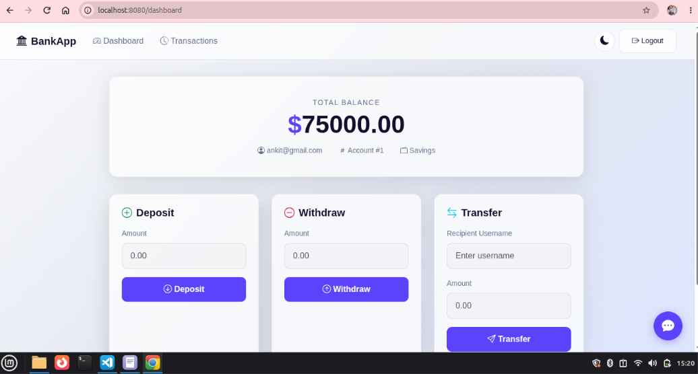
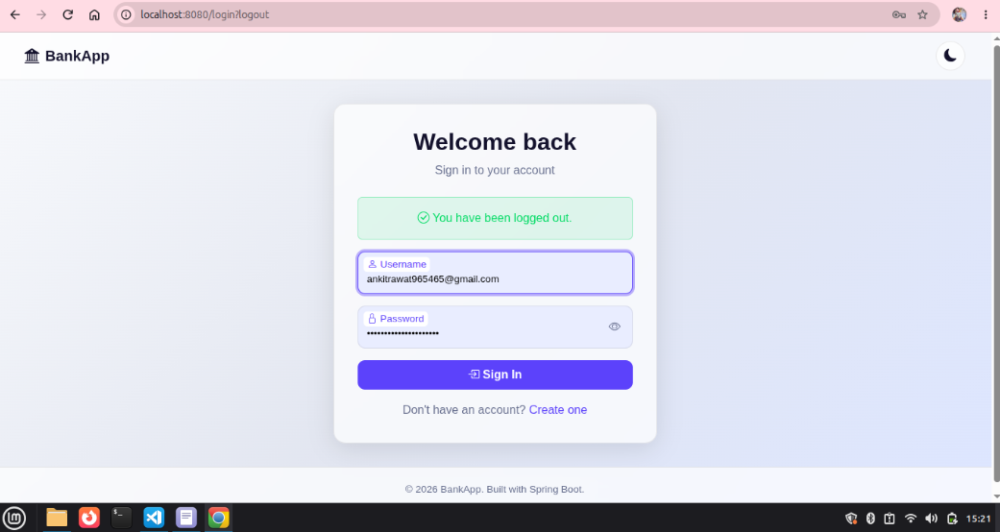
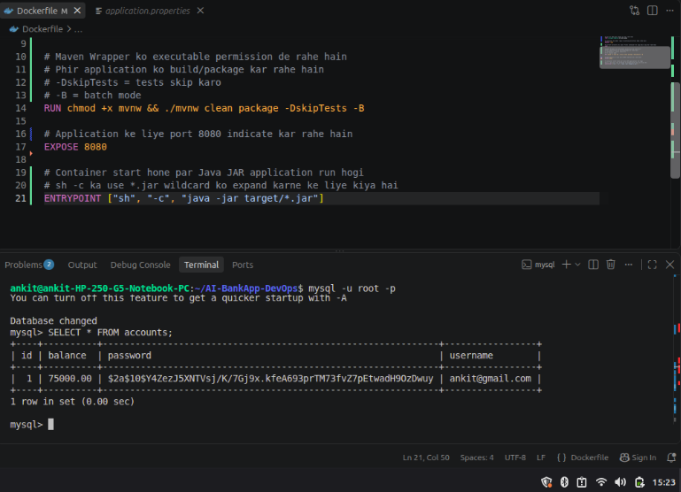

# AI BankApp — Docker & DevOps Project

A Spring Boot banking application containerized and configured with MySQL for local development. The main focus of this project is the DevOps implementation around the application.

📌 Project Overview

AI BankApp is a Spring Boot banking application developed and containerized as a practical DevOps project.

The main focus of this project is implementing the DevOps layer around a Java application:

🐳 Docker containerization
☕ Java 21

🍃 Spring Boot

🗄️ MySQL 8

🔐 Environment-based database configuration
🌐 Docker networking
📦 Docker image & container management
🔎 Application and database verification
🔧 Git & GitHub
🏗️ Architecture

                    🌐 Browser
                        │
                        │ HTTP :8080
                        ▼
              ┌─────────────────────┐
              │   Docker Container  │
              │                     │
              │   Spring Boot App   │
              │      Java 21        │
              └──────────┬──────────┘
                         │
                         │ host.docker.internal:3306
                         ▼
              ┌─────────────────────┐
              │      MySQL 8        │
              │    Host Machine     │
              └──────────┬──────────┘
                         │
                         ▼
                    ┌──────────┐
                    │bankappdb │
                    └────┬─────┘
                         │
                ┌────────┴────────┐
                ▼                 ▼
           accounts          transactions
🛠️ Technology Stack
Technology	Usage
☕ Java 21	Application development
🍃 Spring Boot	Backend application
🐳 Docker	Containerization
🗄️ MySQL 8	Database
🐧 Linux	Development environment
🔧 Git	Version control
🐙 GitHub	Source code management
📂 Project Structure
AI-BankApp-DevOps/
│
├── src/
│   └── main/
│       └── resources/
│           └── application.properties
│
├── Dockerfile
├── pom.xml
├── mvnw
├── README.md
│
├── 01-dashboard.png
├── 02-dashboard.png
└── 03-application.png
🐳 Docker
Build Docker Image
docker build -t ai-bankapp:latest .

Check the image:

docker images
🚀 Run Docker Container
docker run -d \
  --name ai-bankapp \
  --add-host=host.docker.internal:host-gateway \
  -p 8080:8080 \
  -e MYSQL_HOST=host.docker.internal \
  -e MYSQL_PORT=3306 \
  -e MYSQL_DATABASE=bankappdb \
  -e MYSQL_USER=bankapp \
  -e MYSQL_PASSWORD=<your-password> \
  ai-bankapp:latest
Docker Options
Option	Purpose
-d	Run container in background
--name	Set container name
-p 8080:8080	Map application port
--add-host	Allow container to access host
-e	Pass environment variables
🌐 Application

After starting the container:

http://localhost:8080
📸 Application Dashboard

  

🗄️ Database Configuration

The application uses MySQL 8 running on the host machine.

Configuration	Value
Host	host.docker.internal
Port	3306
Database	bankappdb
User	bankapp
Password	Environment Variable

Docker communicates with MySQL through:

host.docker.internal:3306
🔐 Environment Variables

Database credentials are passed to the container using environment variables:

MYSQL_HOST=host.docker.internal
MYSQL_PORT=3306
MYSQL_DATABASE=bankappdb
MYSQL_USER=bankapp
MYSQL_PASSWORD=<your-password>

The database password is not stored directly in the Git repository.

This keeps credentials separate from the application source code.

👤 MySQL Application User

A separate MySQL user was created for the application:

CREATE USER 'bankapp'@'%' IDENTIFIED BY '<your-password>';

GRANT ALL PRIVILEGES
ON bankappdb.*
TO 'bankapp'@'%';

FLUSH PRIVILEGES;

The Spring Boot application uses this user to access the database.

🗃️ Database Structure

Database:

bankappdb

Tables:

accounts
transactions

Check tables:

USE bankappdb;

SHOW TABLES;

Check stored account data:

SELECT * FROM accounts;
📸 Database

  

🔍 Verification
1️⃣ Check Container
docker ps

Expected container:

ai-bankapp
2️⃣ Check Application Logs
docker logs ai-bankapp

Successful database connectivity can be verified through the application logs.

Example:

HikariPool-1 - Start completed.
Database version: 8.0.46
3️⃣ Verify Database
mysql -u root -p

Then:

USE bankappdb;

SHOW TABLES;

SELECT * FROM accounts;

This confirms that application data is successfully stored in MySQL.

🔄 Docker → MySQL Flow
Browser
   │
   │ :8080
   ▼
Spring Boot
   │
   │ Docker Container
   ▼
host.docker.internal
   │
   │ :3306
   ▼
MySQL 8
   │
   ▼
bankappdb
📸 Project Screenshots
Dashboard

  

Database

  

Application

  

💡 DevOps Concepts Practiced

Through this project, I practiced:

Dockerfile creation
Docker image building
Docker container management
Port mapping
Docker networking
Environment variables
MySQL connectivity
MySQL user and permissions
Container logs
Application troubleshooting
Git version control
GitHub repository management
🚀 Future Improvements

Planned DevOps improvements:

GitHub Actions
      ↓
CI/CD Pipeline
      ↓
Docker Image
      ↓
Security Scanning
      ↓
Container Registry
      ↓
Cloud Deployment

Future implementation can include:

GitHub Actions CI/CD
Trivy security scanning
Docker Hub / Amazon ECR
AWS deployment
Kubernetes
Infrastructure as Code
Monitoring & logging
👨‍💻 Author

Ankit Rawat

DevOps | Telecom & GIS

GitHub
Author

Ankit Rawat

DevOps / Telecom & GIS Professional

GitHub:
https://github.com/ankitrawat965465-cyber
